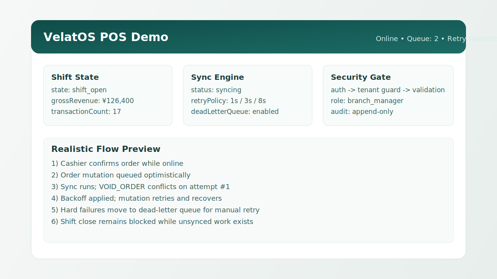
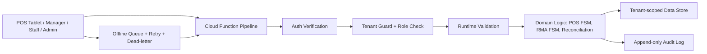

# velatos-showcase

Enterprise ERP architecture showcase: multi-tenant isolation, offline-first operations, and auditable workflows.


---

Created by  
**Sean Raynon**  
Founder & CTO — VelatOS  
https://m-msilver.co.jp  
https://www.linkedin.com/in/seanraynon/

---

## Overview

This repository is a **safe, non-proprietary showcase** of enterprise ERP architecture patterns used in production retail operations software. It demonstrates engineering decisions, module boundaries, offline strategies, multi-tenant isolation, and cloud function patterns — without exposing any real business logic, schemas, or proprietary code.

Think of this as an architectural portfolio: the kind of thinking that goes into a serious, production-grade ERP platform targeting Japanese boutique retail.

Suggested GitHub repository tagline (About box):
`Enterprise ERP architecture showcase: multi-tenant, offline-first, auditable workflows.`


Quick read for hiring review: [One-Page Case Study](docs/case-study.md)

---

## Visual Preview



---

## Architecture Diagram



---

## Tech Stack

- Language: TypeScript (strict mode)
- UI: React 18 patterns (hook-driven modules)
- Testing: Jest + ts-jest with coverage gates
- CI/CD: GitHub Actions (typecheck, tests, Pages deploy)
- Docs: Markdown + Mermaid diagrams + ADRs
- Demo hosting: GitHub Pages static interactive demo

---

## About My Role

I built this showcase end-to-end as Founder/CTO to demonstrate production-style ERP engineering decisions without exposing proprietary VelatOS code.

- System design: tenant boundaries, offline-first behavior, and auditability model
- Application architecture: modular surfaces (POS, manager, staff, admin) with shared typed primitives
- Backend contract design: auth/tenant/validation/audit pipeline for callable functions
- Operational quality: CI gates, coverage enforcement, and explicit design decisions (ADRs)

---

## Hiring Signals

[](https://github.com/seansabado/velatos-showcase/actions/workflows/ci.yml) [](https://github.com/seansabado/velatos-showcase/actions/workflows/pages.yml) [](https://github.com/seansabado/velatos-showcase/actions/workflows/ci.yml) [](https://seansabado.github.io/velatos-showcase/index.html)

- CI-enforced quality gates: typecheck + coverage tests on push and PR
- Enterprise architecture depth: multi-tenant isolation, offline-first queueing, and append-only audit trail
- Production-style domain modeling: POS state machine, RMA lifecycle FSM, and finance reconciliation gates
- Security posture by design: token-claim tenant boundary + runtime payload validation before business logic
- Reviewable engineering artifacts: ADRs, sequence diagrams, and an interactive GitHub Pages demo

---

## Quick Proof Snapshot

| Signal | Current Value |
|---|---|
| Example modules (`src/example-*`) | 6 |
| Test suites (`*.test.ts`) | 9 |
| Coverage (statements / branches / functions / lines) | 96.39% / 81.15% / 100% / 97.16% |
| Architecture Decision Records | 3 |
| Sequence diagrams | 3 |

- Security posture doc: [docs/security-posture.md](docs/security-posture.md)
- Incident walkthrough: [docs/incident-walkthrough.md](docs/incident-walkthrough.md)
- One-page recruiter brief: [docs/case-study.md](docs/case-study.md)

---

## Live Demo

- Interactive static demo: https://seansabado.github.io/velatos-showcase/index.html
- Pages workflow: https://github.com/seansabado/velatos-showcase/actions/workflows/pages.yml

---

## What This Repo Demonstrates

| Area | Pattern |
|---|---|
| **Module boundaries** | POS, Manager Ops, Staff, Admin as isolated vertical slices |
| **Machine state** | XState-style offline-capable FSM for shift sessions and order lifecycle |
| **RMA lifecycle** | 9-state FSM with transition guards for return/repair/exchange flows |
| **Multi-tenancy** | Tenant guard at the function layer; per-tenant data isolation |
| **Internationalization** | JA/EN dual-language strategy with type-safe translation keys |
| **Offline-first** | Local queue + reconciliation pattern for unreliable connectivity |
| **Audit logging** | Append-only audit trail with actor, action, tenant, and timestamp |
| **Cloud functions** | Callable function patterns: auth → tenant guard → business logic → audit |
| **Permission model** | Action-level role gates with declarative React PermissionGate component |
| **Runtime validation** | Boundary payload parsing for untrusted input before business logic |
| **Replay protection** | Idempotency-key sync handling with deduped success semantics |
| **Finance operations** | Daily close and till reconciliation variance-gate pattern |
| **Architecture decisions** | ADRs documenting the "why" behind key design choices |
| **Unit tests** | Jest tests covering FSM guards and tenant isolation logic |
| **Shared infrastructure** | Typed hooks, utilities, and domain types used across all surfaces |

---

## What This Repo Does NOT Contain

- Real database schemas or Firestore collections from any production system
- Real API keys, service account credentials, or environment secrets
- Real business logic, pricing rules, or operational workflows
- Real customer, employee, or transaction data
- Any code that could be directly deployed to a production system

All data, IDs, and logic in this repo are **fabricated for demonstration purposes only**.

---

## How To Navigate

```
docs/                   Architecture and design decision records
  case-study.md         One-page recruiter-focused architecture brief
  security-posture.md   Threat assumptions, controls, and residual risks
  incident-walkthrough.md  Realistic outage analysis and mitigation narrative
  assets/               Visual assets for README and docs
    architecture-banner.svg
    ui-preview.svg
  architecture.md       High-level system diagram and surface map
  module-design.md      How modules are bounded and composed
  i18n-strategy.md      Dual-language (JA/EN) approach
  offline-mode.md       Offline-first patterns and sync strategy
  multi-tenant-erp.md   Tenant isolation and data partitioning
  data-governance.md    Audit logging, access control, PII boundaries
  cloud-functions-patterns.md  Server-side callable function patterns
  decisions/            Architecture Decision Records (ADRs)
    adr-001-tenant-isolation.md
    adr-002-offline-first.md
    adr-003-japanese-primary-locale.md
  sequence-diagrams/    Mermaid sequence diagrams for key flows
    pos-order-flow.md
    offline-sync-flow.md
    rma-lifecycle.md

src/
  example-pos/          Fake POS surface: machine state, shift, orders
    replayScenario.ts   End-to-end offline replay scenario timeline runner
  example-manager/      Fake manager dashboard: branch metrics, approvals
  example-staff/        Fake staff panel: punch-in/out, schedule view
  example-rma/          Fake RMA module: 9-state FSM, line inspection
  example-finance/      Fake finance module: till reconciliation + daily close
  example-functions/    Fake Cloud Functions: auth, tenant guard, audit
    __tests__/          Unit tests for tenant guard and callable patterns
  shared/auth/          Permission utilities + React PermissionGate
  i18n/                 Fake JA/EN translation files + loader
  shared/               Cross-surface hooks, utils, and TypeScript types

site/
  index.html            GitHub Pages static interactive portfolio demo
```

Start with [`docs/architecture.md`](docs/architecture.md) for the big picture, then explore the `src/` modules to see the patterns in action.

---

## Running the Examples

These are TypeScript/React examples — they illustrate patterns, not a deployable app.

```bash
npm install
npm run typecheck   # zero-error TypeScript check
npm test            # Jest unit tests
npm run test:ci     # Coverage thresholds (used by CI)
```

---

## Design Tradeoffs (Why This Architecture)

- Function-layer tenant checks over payload trust:
  Prevents cross-tenant spoofing by always deriving scope from verified token claims.
- Offline-first queue with explicit retry policy:
  Prioritizes business continuity in stores with unstable networks, at the cost of higher sync complexity.
- Append-only audit log:
  Improves traceability and forensics while increasing storage footprint.
- Strict typing + runtime validation:
  Prevents a false sense of safety where compile-time types meet untrusted runtime input.
- Modular vertical slices:
  Keeps boundaries clear and reviewable, with some upfront overhead in shared contract maintenance.

---

## What I'd Improve With More Time

1. Add persistence for offline/dead-letter queues (IndexedDB) and replay metrics dashboard.
2. Introduce contract tests for function pipeline stages and richer failure injections.
3. Add story-driven UI flows per module (POS checkout, RMA resolution, daily close exceptions).
4. Generate typed translation keys automatically from source locale JSON at build time.
5. Replace static coverage badge with automated badge generation in CI.

---

## License

MIT — feel free to reference these patterns in your own work.

---

> "The architecture of a retail ERP is ultimately about trust boundaries: between cashiers and managers, between branches and head office, between connected and offline states."
