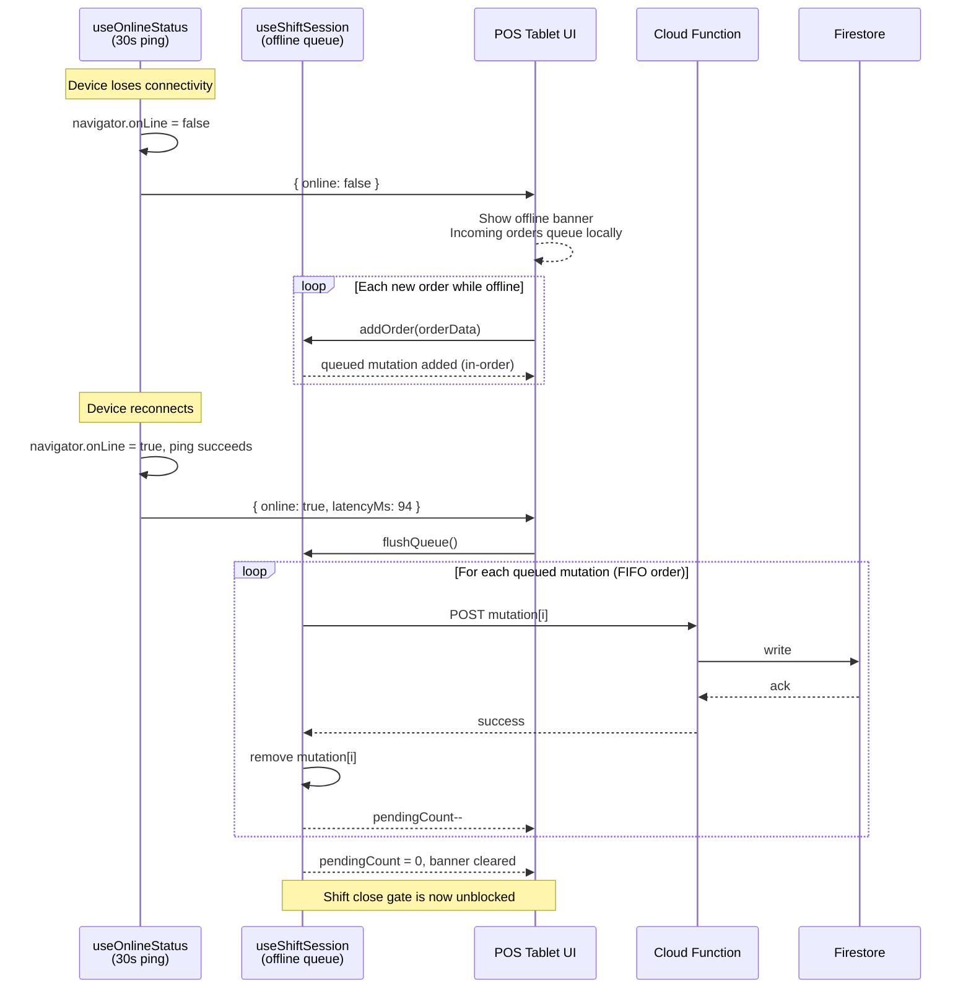

# Offline Queue Sync Flow

Sequence diagram showing how queued mutations are flushed when the device reconnects after an offline period.

```mermaid
sequenceDiagram
    participant Monitor as useOnlineStatus<br/>(30s ping)
    participant Queue as useShiftSession<br/>(offline queue)
    participant POS as POS Tablet UI
    participant API as Cloud Function
    participant DB as Firestore

    Note over Monitor: Device loses connectivity
    Monitor->>Monitor: navigator.onLine = false
    Monitor->>POS: { online: false }
    POS-->>POS: Show offline banner<br/>Incoming orders queue locally

    loop Each new order while offline
        POS->>Queue: addOrder(orderData)
        Queue-->>POS: queued mutation added (in-order)
    end

    Note over Monitor: Device reconnects
    Monitor->>Monitor: navigator.onLine = true, ping succeeds
    Monitor->>POS: { online: true, latencyMs: 94 }
    POS->>Queue: flushQueue()

    loop For each queued mutation (FIFO order)
        Queue->>API: POST mutation[i]
        API->>DB: write
        DB-->>API: ack
        API-->>Queue: success
        Queue->>Queue: remove mutation[i]
        Queue-->>POS: pendingCount--
    end

    Queue-->>POS: pendingCount = 0, banner cleared

    Note over POS,Queue: Shift close gate is now unblocked
```
