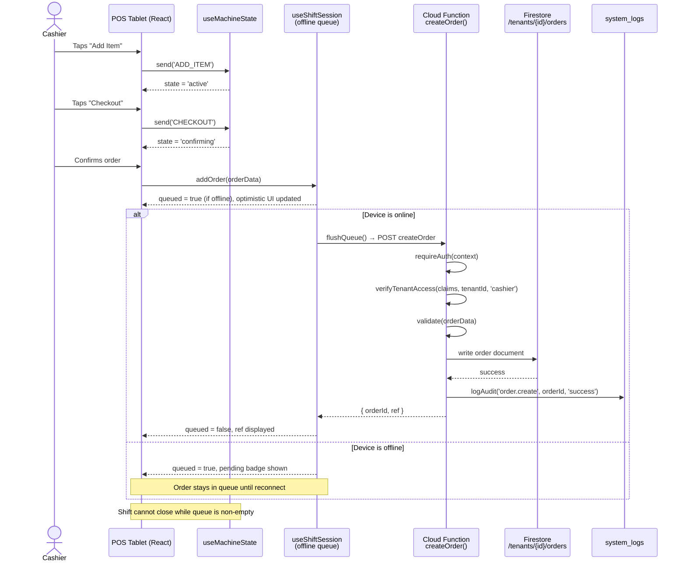

# POS Order Flow

Sequence diagram showing the full lifecycle of a POS order from cashier action to audit log.

```mermaid
sequenceDiagram
    actor Cashier
    participant POS as POS Tablet (React)
    participant FSM as useMachineState
    participant Queue as useShiftSession<br/>(offline queue)
    participant API as Cloud Function<br/>createOrder()
    participant DB as Firestore<br/>/tenants/{id}/orders
    participant Audit as system_logs

    Cashier->>POS: Taps "Add Item"
    POS->>FSM: send('ADD_ITEM')
    FSM-->>POS: state = 'active'

    Cashier->>POS: Taps "Checkout"
    POS->>FSM: send('CHECKOUT')
    FSM-->>POS: state = 'confirming'

    Cashier->>POS: Confirms order
    POS->>Queue: addOrder(orderData)
    Queue-->>POS: queued = true (if offline), optimistic UI updated

    alt Device is online
        Queue->>API: flushQueue() → POST createOrder
        API->>API: requireAuth(context)
        API->>API: verifyTenantAccess(claims, tenantId, 'cashier')
        API->>API: validate(orderData)
        API->>DB: write order document
        DB-->>API: success
        API->>Audit: logAudit('order.create', orderId, 'success')
        API-->>Queue: { orderId, ref }
        Queue-->>POS: queued = false, ref displayed
    else Device is offline
        Queue-->>POS: queued = true, pending badge shown
        Note over POS,Queue: Order stays in queue until reconnect
    end

    Note over POS,FSM: Shift cannot close while queue is non-empty
```
