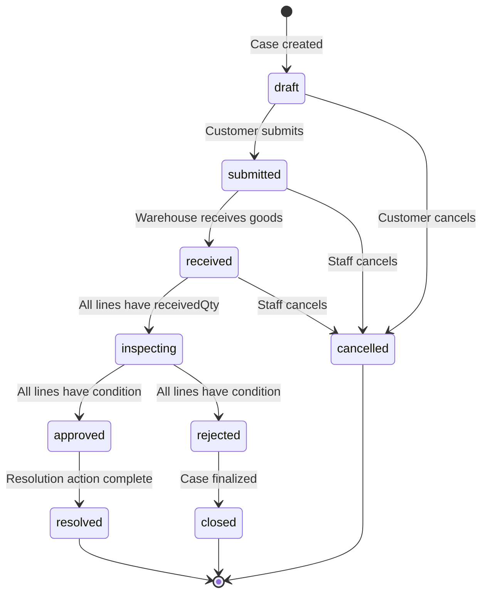
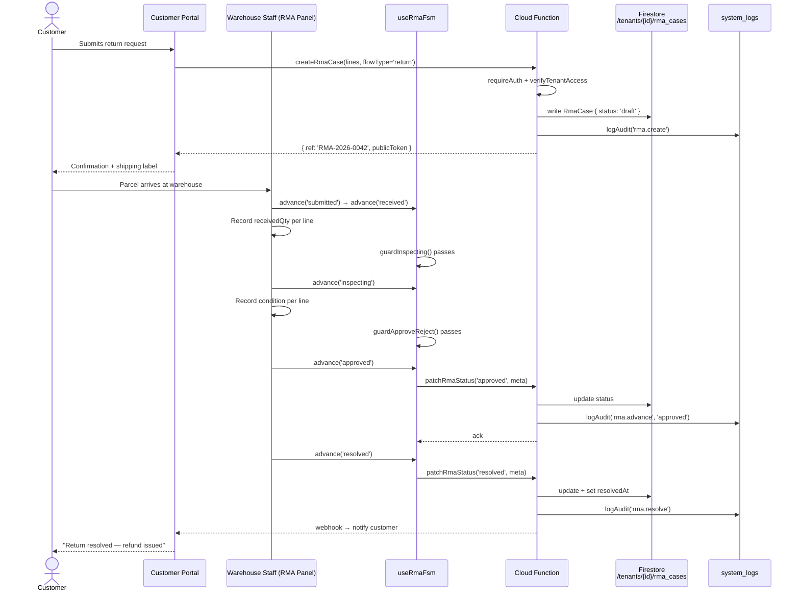

# RMA Lifecycle

State transition diagram for the 9-state RMA FSM, followed by a sequence diagram showing a full return flow end-to-end.

## State Transitions

---

## Full Return Flow (Sequence)

